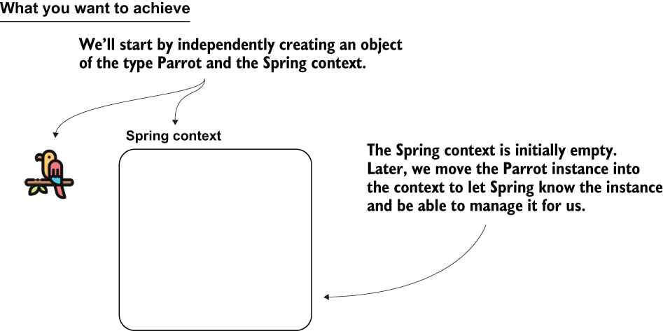
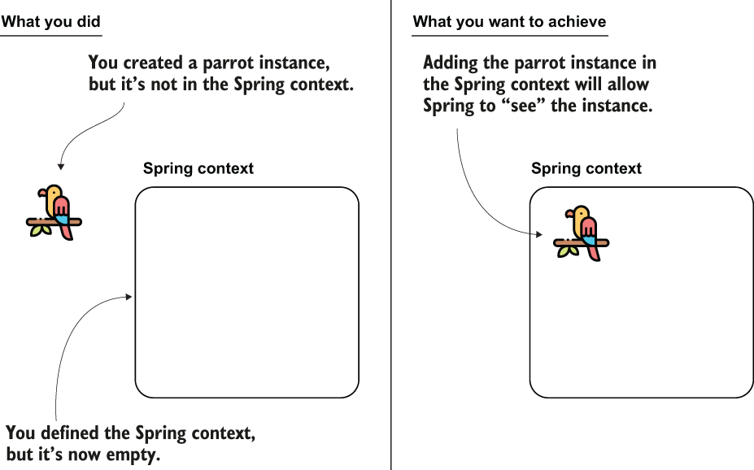
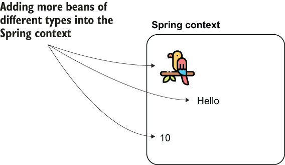
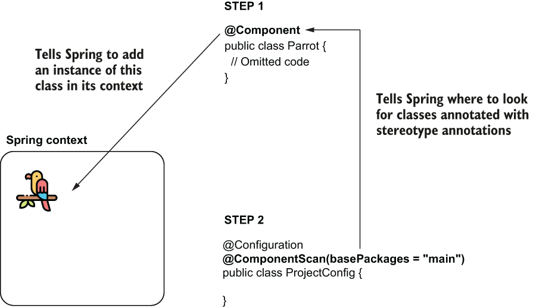
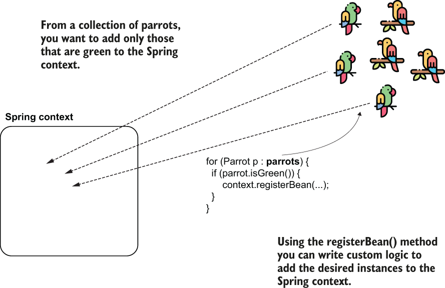
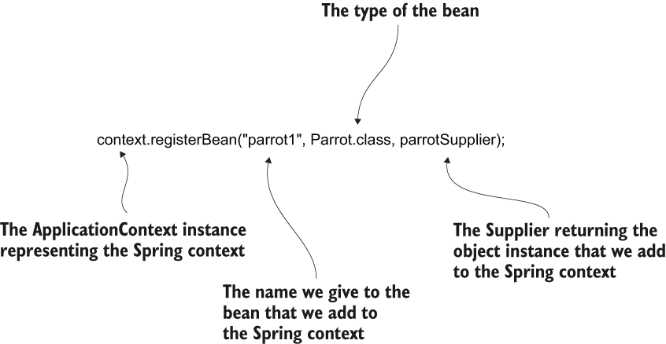

# Defining Beans
- Depending on the action, you’ll choose a specific way to add the bean. You can add beans in the context in the following ways:
	- Using the @Bean annotation
	- Using stereotype annotations
	- Programmatically
- To start, we create an object instance and the empty Spring context.
	- 
- We’ll consider a class named Parrot with only a String attribute representing the name of the parrot. Remember, in this chapter, we only focus on adding beans to the Spring context, so it’s okay to use any object that helps you better remember the syntaxes.
- Parrot Class
	```
	public class Parrot {

	  private String name;

	  // Omitted getters and setters
	}
	```
- You can now define a class containing the main method and create an instance of the class Parrot, as presented in the following listing. I usually name this class Main.
	```
	public class Main {

	  public static void main(String[] args) {
		Parrot p = new Parrot();
	  }
	}
	```
- Adding dependency for Spring Context in pom.xml
	```
	<project xmlns="http://maven.apache.org/POM/4.0.0"
	  xmlns:xsi="http://www.w3.org/2001/XMLSchema-instance"
	  xsi:schemaLocation="http://maven.apache.org/POM/4.0.0     
	  http://maven.apache.org/xsd/maven-4.0.0.xsd">

	  <modelVersion>4.0.0</modelVersion>

	  <groupId>org.example</groupId>
	  <artifactId>sq-ch2-ex1</artifactId>
	  <version>1.0-SNAPSHOT</version>

	  <dependencies>
		 <dependency>
			<groupId>org.springframework</groupId>
			<artifactId>spring-context</artifactId>
			<version>5.2.6.RELEASE</version>
		 </dependency>
	  </dependencies>

	</project>
	```
- A critical thing to observe is that Spring is designed to be modular. By modular, I mean that you don’t need to add the whole Spring to your app when you use something out of the Spring ecosystem. You just need to add those parts that you use.
- With the dependency added to our project, we can create an instance of the Spring context. In the next listing, you can see how I’ve changed the main method to create the Spring context instance.
- Creating instance of Spring Context
	```
	public class Main {

	  public static void main(String[] args) {
		var context = 
		   new AnnotationConfigApplicationContext();     ❶

		Parrot p = new Parrot();
	  }
	}
	```
	❶ Creates an instance of the Spring context
- We use the **AnnotationConfigApplicationContext** class to create the Spring context instance. Spring offers multiple implementations. Because in most cases you’ll use the AnnotationConfigApplicationContext class (the implementation that uses the most used today’s approach: **annotations**),
- You created an instance of Parrot, added the Spring context dependencies to your project, and created an instance of the Spring context. Your objective is to add the Parrot object to the context, which is the next step.
	
## Using the @Bean annotation to add beans into the Spring context
* * *
- This makes it possible for you to add the instances of the classes defined in your project (like Parrot in our case), as well as classes you didn’t create yourself but you use in your app. I believe this approach is the easiest to understand when starting out. Remember that the reason you learn to add beans to the Spring context is that Spring can manage only the objects that are part of it.
- The steps you need to follow to add a bean to the Spring context using the @Bean annotation are as follows:
	- Define a configuration class (annotated with **@Configuration**) for your project, which, we use to configure the context of Spring.
	- Add a method to the configuration class that returns the object instance you want to add to the context and annotate the method with the **@Bean** annotation.
	- Make Spring use the configuration class defined in step 1. As you’ll learn later, we use configuration classes to write different configurations for the framework.
- Steps for adding the bean to the context using the **@Bean** annotation. By adding the instance to the Spring context, you make the framework aware of the object, enabling it to manage the instance.
	
- A **configuration class** is a special class in Spring applications that we use to instruct Spring to do specific actions. For example, we can tell Spring to create beans or to enable certain functionalities.
- A Spring configuration class is characterized by the fact that it is annotated with the **@Configuration** annotation. We use the configuration classes to define various Spring-related configurations for the project.
	```
	@Configuration                    ❶
	public class ProjectConfig {
	
	}
	```
	❶ We use the @Configuration annotation to define this class as a Spring configuration class.
- One of the things you can do with a configuration class is add beans to the Spring context. To do this, we need to define a method that returns the object instance we wish to add to the context and annotate that method with the @Bean annotation, which lets Spring know that it needs to call this method when it initializes its context and adds the returned value to the context.
- Defining the **@Bean** method
	```
	@Configuration
	public class ProjectConfig {

	  @Bean                        ❶
	  Parrot parrot() {
		var p = new Parrot();
		p.setName("Koko");         ❷
		return p;                  ❸
	  }
	}
	```
	❶ By adding the @Bean annotation, we instruct Spring to call this method when at context initialization and add the returned value to the context.
	❷ Set a name for the parrot we’ll use later when we test the app.
	❸ Spring adds to its context the Parrot instance returned by the method.
- Observe that the name I used for the method doesn’t contain a verb. You probably learned that a Java best practice is to put verbs in method names because the methods generally represent actions. But for methods we use to add beans in the Spring context, we don’t follow this convention. Such methods represent the object instances they return and that will now be part of the Spring context. The method’s name also becomes the bean’s name. By convention, you can use nouns, and most often they have the same name as the class.
- Now we need to make sure Spring uses this configuration class when initializing its context.
- Initializing the Spring context based on the defined configuration class
	```
	public class Main {

	  public static void main(String[] args) {
		var context = 
		  new AnnotationConfigApplicationContext(
				ProjectConfig.class);                ❶
	  }
	 
	}
	```
	❶ When creating the Spring context instance, send the configuration class as a parameter to instruct Spring to use it.
- To verify the Parrot instance is indeed part of the context now, you can refer to the instance and print its name in the console.
	```
	public class Main {

	  public static void main(String[] args) {
		var context = 
		  new AnnotationConfigApplicationContext(
			ProjectConfig.class);

		Parrot p = context.getBean(Parrot.class);    ❶

		System.out.println(p.getName());
	  }
	}
	```
	❶ Gets a reference of a bean of type Parrot from the Spring context
- Now you’ll see the name you gave to the parrot you added in the context in the console, in my case Koko.
- In real-world scenarios, we use unit and integration tests to validate that our implementations work as desired.
- As in the previous example, you can add any kind of object to the Spring context. Let’s also add a String and an Integer and see that it’s working.
- You can add any object to the Spring context to make Spring aware of it.
	- 
- Adding two more beans to the context
	```
	@Configuration
	public class ProjectConfig {

	  @Bean
	  Parrot parrot() {
		var p = new Parrot();
		p.setName("Koko");
		return p;
	  }

	  @Bean                  ❶
	  String hello() {
		return "Hello";
	  }

	  @Bean                  ❷
	  Integer ten() {
		return 10;
	  }
	}
	```
	❶ Adds the string “Hello” to the Spring context
	❷ Adds the integer 10 to the Spring context
- Remember the Spring context’s purpose: we add the instances we expect Spring needs to manage. (This way, we plug in functionalities offered by the framework.) In a real-world app, we won’t add every object to the Spring context.
- Printing the two new beans in the console
	```
	public class Main {

	  public static void main(String[] args) {
		var context = new AnnotationConfigApplicationContext(
					   ProjectConfig.class);

		Parrot p = context.getBean(Parrot.class);    ❶
		System.out.println(p.getName());

		String s = context.getBean(String.class);
		System.out.println(s);

		Integer n = context.getBean(Integer.class);
		System.out.println(n);
	  }
	}
	```
	❶ You don’t need to do any explicit casting. Spring looks for a bean of the type you requested in its context. If such a bean doesn’t exist, Spring will throw an exception.
- Running the app now, the values of the three beans will be printed in the console, as shown in the next code snippet.
	```
	
	Koko
	Hello
	10
	```
- Thus far we added one or more beans of different types to the Spring context. But could we add more than one object of the same type? If yes, how can we individually refer to these objects?
- You can add more beans of the same type to the Spring context by using multiple methods annotated with @Bean. Each instance will have a unique identifier. To refer to them afterward, you’ll need to use the beans’ identifiers.
	
- Don’t confuse the name of the bean with the name of the parrot. In our example, the beans’ names (or identifiers) in the Spring context are parrot1, parrot2, and parrot3 (like the name of the @Bean methods defining them). The names I gave to the parrots are Koko, Miki, and Riki. The parrot name is just an attribute of the Parrot object, and it doesn’t mean anything to Spring.
- You can declare as many instances of the same type as you wish by simply declaring more methods annotated with the @Bean annotation. The following listing shows you how I’ve declared three beans of type Parrot in the configuration class.
- Adding multiple beans of the same type to the Spring context
```
@Configuration
public class ProjectConfig {
 
  @Bean
  Parrot parrot1() {
    var p = new Parrot();
    p.setName("Koko");
    return p;
  }
 
  @Bean
  Parrot parrot2() {
    var p = new Parrot();
    p.setName("Miki");
    return p;
  }
 
  @Bean
  Parrot parrot3() {
    var p = new Parrot();
    p.setName("Riki");
    return p;
  }
}
```
- Of course, you can’t get the beans from the context anymore by only specifying the type. If you do, you’ll get an exception because Spring cannot guess which instance you’ve declared you refer to. Look at the following listing. Running such a code throws an exception in which Spring tells you that you need to be precise, which is the instance you want to use.
- Referring to a Parrot instance by type
	```
	public class Main {

	  public static void main(String[] args) {
		var context = new 
		  AnnotationConfigApplicationContext(ProjectConfig.class);

		Parrot p = context.getBean(Parrot.class);    ❶

		System.out.println(p.getName());

	  }
	}
	```
	❶ You’ll get an exception on this line because Spring cannot guess which of the three Parrot instances you refer to.
- When running your application, you’ll get an exception similar to the one presented by the next code snippet.
	```
	
	Exception in thread "main" org.springframework.beans.factory.NoUniqueBeanDefinitionException: No qualifying bean of type 'main.Parrot' available: expected single matching bean but found 3: 
		 parrot1,parrot2,parrot3    ❶
		 at ...
	```
	❶ Names of the Parrot beans in the context
- To solve this ambiguity problem, you need to refer precisely to one of the instances by using the bean’s name. By default, Spring uses the names of the methods annotated with @Bean as the beans’ names themselves. Remember that’s why we don’t name the @Bean methods using verbs. In our case, the beans have the names parrot1, parrot2, and parrot3 (remember, the method represents the bean). You can find these names in the previous code snippet in the message of the exception. Did you spot them? Let’s change the main method to refer to one of these beans explicitly by using its name. Observe how I referred to the parrot2 bean in the following listing.
- Referring to a bean by its identifier
	```
	public class Main {

	  public static void main(String[] args) {
		var context = new 
		  AnnotationConfigApplicationContext(ProjectConfig.class);

		Parrot p = context.getBean("parrot2", Parrot.class);    ❶
		System.out.println(p.getName());

	  }
	}
	```
	❶ First parameter is the name of the instance to which we refer
- Running the app now, you’ll no longer get an exception. Instead, you’ll see in the console the name of the second parrot, Miki.
- If you’d like to give another name to the bean, you can use either one of the name or the value attributes of the @Bean annotation. Any of the following syntaxes will change the name of the bean in "miki":
	- @Bean(name = "miki")
	- @Bean(value = "miki")
	- @Bean("miki")
- In the next code snippet, you can observe the change as it appears in code
	```
	@Bean(name = "miki")    ❶
	Parrot parrot2() {
	  var p = new Parrot();
	  p.setName("Miki");    ❷
	  return p;
	}
	```
	❶ Sets the name of the bean
	❷ Sets the name of the parrot
## Using stereotype annotations to add beans to the Spring context
* * *
- When you have multiple beans of the same kind in the Spring context you can make one of them primary. You mark the bean you want to be primary using the @Primary annotation. A primary bean is the one Spring will choose if it has multiple options and you don’t specify a name; the primary bean is simply Spring’s default choice.
	```
	@Bean
	@Primary
	Parrot parrot2() {
	  var p = new Parrot();
	  p.setName("Miki");
	  return p;
	}
	```
- If you refer to a Parrot without specifying the name, Spring will now select Miki by default. Of course, you can only define one bean of a type as primary.
- With stereotype annotations, you add the annotation above the class for which you need to have an instance in the Spring context. When doing so, we say that you’ve marked the class as a **component**. When the app creates the Spring context, Spring creates an instance of the class you marked as a **component** and adds that instance to its context. We’ll still have a **configuration class** when we use this approach to tell Spring where to look for the classes annotated with stereotype annotations. Moreover, you can use both the approaches (using @Bean and stereotype annotations together)
- The steps we need to follow in the process are as follows:
	- Using the **@Component** annotation, mark the classes for which you want Spring to add an instance to its context (in our case Parrot).
	- Using **@ComponentScan** annotation over the configuration class, instruct Spring on where to find the classes you marked.
- When using stereotype annotations, consider two steps. First, use the stereotype annotation (@Component) to annotate the class for which you want Spring to add a bean to its context. Second, use the @ComponentScan annotation to tell Spring where to look for classes annotated with stereotype annotations.
	- 
- Let’s take our example with the Parrot class. We can add an instance of the class in the Spring context by annotating the Parrot class with one of the stereotype annotations, say @Component.
- The next listing shows you how to use the @Component annotation for the Parrot class.
- Using a stereotype annotation for the Parrot class
	```
	@Component               ❶
	public class Parrot {

	  private String name;

	  public String getName() {
		return name;
	  }

	  public void setName(String name) {
		this.name = name;
	  }
	}
	```
	❶ By using the @Component annotation over the class, we instruct Spring to create an instance of this class and add it to its context.
- To tell Spring it needs to search for classes annotated with stereotype annotations, we use the **@ComponentScan** annotation over the configuration class. Also, with the **@ComponentScan** annotation, we tell Spring where to look for these classes. We enumerate the packages where we defined the classes with stereotype annotations.
- The next listing shows you how to use the @ComponentScan annotation over the configuration class of the project. In my case, the name of the package is “main.”
- Using the @ComponentScan annotation to tell Spring where to look
	```
	@Configuration
	@ComponentScan(basePackages = "main")     ❶
	public class ProjectConfig {

	}
	```
	❶ Using the basePackages attribute of the annotation, we tell Spring where to look for classes annotated with stereotype annotations.
- Now you told Spring the following:
	- Which classes to add an instance to its context (Parrot)
	- Where to find these classes (using @ComponentScan)
- We don’t need methods anymore to define the beans. And it now looks like this approach is better because you achieve the same thing by writing less code.
- You can continue writing the main method as presented in the following listing to prove that Spring creates and adds the bean in its context.
- Defining the main method to test the Spring configuration
	```
	public class Main {

	  public static void main(String[] args) {
		var context = new 
		  AnnotationConfigApplicationContext(ProjectConfig.class);

		  Parrot p = context.getBean(Parrot.class);

		  System.out.println(p);             ❶
		  System.out.println(p.getName());   ❷
	  }
	}
	```
	❶ Prints the default String representation of the instance taken from the Spring context
	❷ Prints null because we did not assign any name to the parrot instance added by Spring in its context
- Running this application, you’ll observe Spring added a Parrot instance to its context because the first value printed is the default String representation of this instance. However, the second value printed is null because we did not assign any name to this parrot. Spring just creates the instance of the class, but it’s still our duty if we want to change this instance in any way afterward (like assigning it a name).
- Advantages and disadvantages: A comparison of the two ways of adding beans to the Spring context, which tells you when you would use either of them
	- | Using the @Bean annotation                                                                                                                                                                                                                                       | Using stereotype annotations                                                                                                                                                                                                                                                                              |
	  | ---------------------------------------------------------------------------------------------------------------------------------------------------------------------------------------------------------------------------------------------------------------- | --------------------------------------------------------------------------------------------------------------------------------------------------------------------------------------------------------------------------------------------------------------------------------------------------------- |
	  | You have full control over the instance creation you add to the Spring context. It is your responsibility to create and configure the instance in the body of the method annotated with @Bean. Spring only takes that instance and adds it to the context as-is. | You only have control over the instance after the framework creates it.                                                                                                                                                                                                                                   |
	  | You can use this method to add more instances of the same type to the Spring context. Remember, in section 2.1.1 we added three Parrot instances into the Spring context.                                                                                        | This way, you can only add one instance of the class to the context.                                                                                                                                                                                                                                      |
	  | You can use the @Bean annotation to add to the Spring context any object instance. The class that defines the instance doesn’t need to be defined in your app. Remember, earlier we added a String and an Integer to the Spring context.                         | You can use stereotype annotations only to create beans of the classes your application owns. For example, you couldn’t add a bean of type String or Integer like we did in section 2.1.1 with the @Bean annotation because you don’t own these classes to change them by adding a stereotype annotation. |
	  | You need to write a separate method for each bean you create, which adds boilerplate code to your app. For this reason, we prefer using @Bean as a second option to stereotype annotations in our projects.                                                      | Using stereotype annotations to add beans to the Spring context doesn’t add boilerplate code to your app. You’ll prefer this approach in general for the classes that belong to your app.                                                                                                                 |
- What you’ll observe is that in real-world scenarios you’ll use stereotype annotations as much as possible (because this approach implies writing less code), and you’ll only use the **@Bean** when you can’t add the bean otherwise (e.g., you create the bean for a class that is part of a library so you cannot modify that class to add the stereotype annotation).
## Using @PostConstruct to manage the instance after its creation
* * *
- Using stereotype annotations you instruct Spring to create a bean and add it to its context. But, unlike using the @Bean annotation, you don’t have full control over the instance creation. Using @Bean, we were able to define a name for each of the Parrot instances we added to the Spring context, but using @Component, we didn’t get a chance to do something after Spring called the constructor of the Parrot class. What if we want to execute some instructions right after Spring creates the bean? We can use the **@PostConstruct** annotation.
- Spring borrows the **@PostConstruct** annotation from Java EE. We can also use this annotation with Spring beans to specify a set of instructions Spring executes after the bean creation. You just need to define a method in the component class and annotate that method with @PostConstruct, which instructs Spring to call that method after the constructor finishes its execution.
- Let’s add to pom.xml the Maven dependency needed to use the **@PostConstruct** annotation:
	```
	<dependency>
	   <groupId>javax.annotation</groupId>
	   <artifactId>javax.annotation-api</artifactId>
	   <version>1.3.2</version>
	</dependency>
	```
- You don’t need to add this dependency if you use a Java version smaller than Java 11. Before Java 11, the Java EE dependencies were part of the JDK. With Java 11, the JDK was cleaned of the APIs not related to SE, including the Java EE dependencies. If you wish to use functionalities that were part of the removed APIs (like @PostConstruct), you now need to explicitly add the dependency in your app.
- Now you can define a method in the Parrot class, as presented in the next code snippet:
	```
	@Component
	public class Parrot {

	  private String name;

	  @PostConstruct
	  public void init() {
		this.name = "Kiki";
	  }

	  // Omitted code
	}
	```
- If you now print the name of the parrot in the console, you’ll observe the app prints the value Kiki in the console.
- Very similarly, but less encountered in real-world apps, you can use an annotation named **@PreDestroy**. With this annotation, you define a method that Spring calls immediately before closing and clearing the context.
- But generally I recommend developers avoid using it and find a different approach to executing something before Spring clears the context, mainly because you can expect Spring to fail to clear the context. Say you defined something sensitive (like closing a database connection) in the **@PreDestroy** method; if Spring doesn’t call the method, you may get into big problems.
## Programmatically adding beans to the Spring context
* * *
- We’ve had the option of programmatically adding beans to the Spring context with Spring 5, which offers great flexibility because it enables you to add new instances in the context directly by calling a method of the context instance. You’d use this approach when you want to implement a custom way of adding beans to the context and the **@Bean** or the stereotype annotations are not enough for your needs.
- With the @Bean and stereotype annotations, you can implement most of the scenarios, but you can’t do something like the code presented in the next snippet:
	```
	if (condition) {  
	   registerBean(b1);    ❶

	} else {

	   registerBean(b2);    ❷

	}
	```
	❶ If the condition is true, add a specific bean to the Spring context.
	❷ Otherwise, add another bean to the Spring context.
- To keep using our parrots example, the scenario is as follows: The app reads a collection of parrots. Some of them are green; others are orange. You want the app to add to the Spring context only the parrots that are green.
- Using the registerBean() method to add specific object instances to the Spring context.
	- 
- To add a bean to the Spring context using a programmatic approach, you just need to call the registerBean() method of the ApplicationContext instance. The registerBean() has four parameters, as presented in the next code snippet:
	```
	<T> void registerBean(
	  String beanName, 
	  Class<T> beanClass, 
	  Supplier<T> supplier, 
	  BeanDefinitionCustomizer... customizers);
	```
	- Use the first parameter **beanName** to define a name for the bean you add in the Spring context. If you don’t need to give a name to the bean you’re adding, you can use null as a value when you call the method.
	- The second parameter is the **class** that defines the bean you add to the context. Say you want to add an instance of the class Parrot; the value you give to this parameter is Parrot.class.
	- The third parameter is an instance of **Supplier**. The implementation of this Supplier needs to return the value of the instance you add to the context. Remember, Supplier is a functional interface you find in the java.util .function package. The purpose of a supplier implementation is to return a value you define without taking parameters.
	- The fourth and last parameter is a varargs of **BeanDefinitionCustomizer**. (If this doesn’t sound familiar, that’s okay; the BeanDefinitionCustomizer is just an interface you implement to configure different characteristics of the bean; e.g., making it primary.) Being defined as a varargs type, you can omit this parameter entirely, or you can give it more values of type BeanDefinitionCustomizer.
- You observe that this project’s configuration class is empty, and the Parrot class we use for our bean definition example is just a plain old Java object (POJO); we use no annotation with it. In the next code snippet, you find the configuration class as I defined it for this example:
	```
	@Configuration
	public class ProjectConfig {
	}
	```
- I defined the class Parrot that we use to create the bean:
	```
	public class Parrot {

	  private String name;

	  // Omitted getters and setters
	}
	```
- Calling the registerBean() method to add a bean to the Spring context programmatically
	- 
- In the main method of the project, I’ve used the registerBean() method to add an instance of type Parrot to the Spring context. The next listing presents the code of the main method.
- Using the registerBean() method to add a bean to the Spring context
	```
	public class Main {

	  public static void main(String[] args) {
		var context = 
		  new AnnotationConfigApplicationContext(
			  ProjectConfig.class);

		  Parrot x = new Parrot();                     ❶
		  x.setName("Kiki");

		  Supplier<Parrot> parrotSupplier = () -> x;   ❷

		  context.registerBean("parrot1", 
			Parrot.class, parrotSupplier);             ❸

		  Parrot p = context.getBean(Parrot.class);    ❹
		  System.out.println(p.getName());             ❹
	  }
	}
	```
	❶ We create the instance we want to add to the Spring context.
	❷ We define a Supplier to return this instance.
	❸ We call the registerBean() method to add the instance to the Spring context.
	❹ To verify the bean is now in the context, we refer to the parrot bean and print its name in the console.
- Use one or more bean configurator instances as the last parameters to set different characteristics of the beans you add. For example, you can make the bean primary by changing the registerBean() method call, as shown in the next code snippet. A primary bean defines the instance Spring selects by default if you have multiple beans of the same type in the context:
	```
	context.registerBean("parrot1", 
					Parrot.class, 
					parrotSupplier, 
					bc -> bc.setPrimary(true));
	```
